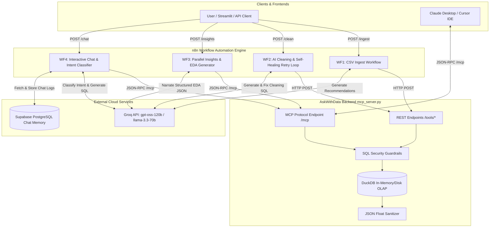

# AskWithData 📊🤖

**Autonomous AI Data Analytics Engine & Dual-Protocol MCP Server with n8n Workflow Automation**

AskWithData is an enterprise-grade AI analytics system powered by **DuckDB**, **FastAPI**, **Model Context Protocol (MCP)**, **n8n Workflow Automation**, **Groq LLM Acceleration**, and **Supabase (PostgreSQL)**. 

It transforms raw CSV files into an interactive, self-cleaning, conversational analytics platform with automated Exploratory Data Analysis (EDA), structured intent classification, self-correcting SQL execution, and session-aware conversational AI.

---

## 🌟 Architecture & Key Features

* ⚡ **Dual-Protocol Engine**: Exposes both **MCP (Model Context Protocol)** endpoints for AI IDEs (Claude Desktop, Cursor) at `/mcp` and dedicated **REST endpoints** for n8n Webhook nodes at `/tools/*`.
* 🚀 **Vectorized DuckDB Performance**: High-speed OLAP analytical queries powered by DuckDB's in-process engine (`read_csv_auto`), enabling sub-50ms execution on 100K+ row datasets.
* 🤖 **4 Production-Grade n8n Automation Workflows**:
  * **`WF1 - CSV Ingest.json`**: Webhook-triggered CSV loader that imports files into DuckDB and calls Groq (`openai/gpt-oss-120b`) to suggest 3–4 tailored data cleaning recommendations.
  * **`WF2 - AI Cleaning.json`**: LLM SQL generator with built-in AST/regex safety validation and an **autonomous self-healing retry loop** to re-prompt and fix failed cleaning statements.
  * **`WF3 - Initial Insights.json`**: Parallel multi-table data profiler and automated EDA engine powered by Groq (`llama-3.3-70b-versatile`) producing structured summaries, metrics, anomalies, and chart configurations.
  * **`WF4 - Interactive Chat.json`**: Conversational SQL assistant with **5-way Intent Classification** (`UNDERSTAND`, `COMPARE`, `BREAKDOWN`, `QUERY`, `OTHER`), parallel context gathering (Supabase history + schema overview), dynamic DuckDB query execution, and PostgreSQL persistence.
* 🔒 **Security & SQL Guardrails**: Strict separation between read-only analysis (`run_analysis_query` enforcing `SELECT` only) and state-modifying operations (`execute_cleaning_query` allowing only `UPDATE`, `DELETE FROM`, `ALTER TABLE` while blocking `DROP`, `TRUNCATE`, `CREATE`, `INSERT`).
* 🛡️ **Zero-Crash JSON Sanitizer**: 2-pass sanitization (`safe_float` and `safe_df_to_records`) catching float `NaN`, `Infinity`, and `-Infinity` edge cases from Pandas/DuckDB to guarantee 100% JSON-compliant API responses.
* 💾 **Low-Latency Session Memory**: Powered by **Supabase PostgreSQL** with composite B-Tree indexing (`session_id`, `created_at DESC`) for sub-25ms chat history retrieval.

---

## 📐 System Architecture Diagram



---

## 🔄 Detailed n8n Workflow Breakdowns

### 1. `WF1 - CSV Ingest.json` (Automated Ingestion & Cleaning Suggestions)
* **Trigger**: Webhook `POST /ingest` receiving `{ "files": [ { "file_path": "...", "table_name": "..." } ] }`.
* **Flow**:
  1. `Split Files Array` (Code Node): Splits incoming file list into individual execution items.
  2. `MCP: load_csv_to_table`: Calls backend REST endpoint to ingest CSV into DuckDB.
  3. `Collect Load Results` (Aggregate Node): Consolidates ingestion status across all files.
  4. `MCP: get_schema_overview`: Retrieves updated DuckDB table schemas and sample rows.
  5. `Groq: Suggest Cleaning`: Prompts Groq (`openai/gpt-oss-120b`) to generate 3–4 actionable cleaning recommendations plus a custom SQL option.
  6. `Respond to Webhook`: Returns loaded schema and cleaning suggestions to the caller.

---

### 2. `WF2 - AI Cleaning.json` (Guardrailed SQL Execution & Self-Healing Retry Loop)
* **Trigger**: Webhook `POST /clean` receiving `{ "user_instruction": "..." }`.
* **Flow**:
  1. `MCP: get_schema_overview`: Fetches active table schemas.
  2. `Groq: Generate SQL`: Asks Groq (`openai/gpt-oss-120b`) to generate standard `UPDATE`, `DELETE FROM`, or `ALTER TABLE` statements.
  3. `Validate + Split SQL` (Code Node): Enforces strict safety rules—rejects any statement containing `DROP`, `TRUNCATE`, `CREATE`, or `INSERT`.
  4. `MCP: execute_cleaning_query`: Sends validated statements to DuckDB.
  5. **Self-Healing Retry Loop (`If: has_failures`)**:
     * If execution fails, `Build Retry Prompt` extracts the exact DuckDB error traceback and schema.
     * `Groq: Retry SQL` re-generates corrected SQL statements.
     * `Validate + Split SQL1` re-validates and executes via `MCP: execute_cleaning_query1`.
  6. `Respond to Webhook`: Delivers detailed execution results (rows affected, success counts, statement breakdown).

---

### 3. `WF3 - Initial Insights.json` (Parallel Multi-Table EDA & Profiling)
* **Trigger**: Webhook `POST /insights` receiving `{ "tables": ["table1", "table2"] }`.
* **Flow**:
  1. `Code: Split Tables`: Fans out table names into parallel streams.
  2. `MCP: generate_initial_insights`: Executes parallel JSON-RPC calls over `/mcp` fetching column nulls, min/max/avg/stddev, date boundaries, and top string frequencies.
  3. `Aggregate: All Table Stats`: Combines statistical metrics from all tables.
  4. `Groq: Narrate Insights`: Prompts Groq (`llama-3.3-70b-versatile`) to generate structured JSON containing:
     * `summary_text`: Executive data summary.
     * `key_metrics`: Highlighted metrics per table.
     * `anomalies`: Detected data quality issues.
     * `chart_data`: Formatted chart configurations (bar/line charts with x_labels and y_values).
  5. `Code: Parse Insights JSON`: Safely strips markdown fences and validates JSON schema before responding to Webhook.

---

### 4. `WF4 - Interactive Chat.json` (Intent Classification & Persistent Memory Chat)
* **Trigger**: Webhook `POST /chat` receiving `{ "session_id": "...", "user_message": "..." }`.
* **Flow**:
  1. **Parallel Pre-Fetch**:
     * `Supabase: Fetch History`: Retrieves last 10 session messages from Supabase PostgreSQL using optimized B-Tree index.
     * `MCP: get_schema_overview`: Pulls active DuckDB schema.
  2. `Groq: Classify Intent`: Uses Groq (`llama-3.3-70b-versatile`) to categorize query into one of 5 distinct intents:
     * `UNDERSTAND`: Explaining metric drivers and root causes.
     * `COMPARE`: Segment & period comparison.
     * `BREAKDOWN`: Decomposing totals.
     * `QUERY`: Data retrieval requiring DuckDB `SELECT`.
     * `OTHER`: General assistance.
  3. `Code: Route Intent` & `Code: Build Full Prompt`: Constructs tailored system prompts incorporating schema, history, and intent rules.
  4. `Groq: Chat Completion`: Generates response text, source column citations, optional chart data, and optional SQL `query_to_run`.
  5. `IF: Needs Data Query?`: If `query_to_run` is present, calls `MCP: run_analysis_query` to fetch live DuckDB results.
  6. `Supabase: Save Messages`: Persists both user and assistant messages into PostgreSQL `messages` table.
  7. `Respond to Webhook`: Returns answer text, chart payload, data sources, intent type, and query results.

---

## 📁 Repository Structure

```text
ask_with_data/
├── mcp_server.py             # FastAPI + DuckDB core backend (MCP & REST dual mode)
├── requirement.txt           # Python dependencies (mcp, fastapi, duckdb, pandas, uvicorn)
├── .env.example              # Environment variables template
├── supabase_commands.txt     # PostgreSQL SQL DDL & B-Tree index setup script
├── WF1 - CSV Ingest.json     # n8n Workflow: CSV ingestion & cleaning suggestions
├── WF2 - AI Cleaning.json    # n8n Workflow: Guardrailed cleaning & retry loop
├── WF3 - Initial Insights.json # n8n Workflow: Parallel EDA & chart generation
├── WF4 - Interactive Chat.json # n8n Workflow: Intent classifier & chat assistant
├── analytics.duckdb          # Local DuckDB database storage file
└── demo.csv                  # Sample test dataset
```

---

## 🚀 Installation & Quick Start Guide

### 1. Prerequisites
- **Python**: `3.10+`
- **PostgreSQL Database**: Supabase instance (or local PostgreSQL)
- **n8n**: Cloud or self-hosted instance
- **Groq API Key**: For fast LLM inference (`gpt-oss-120b` and `llama-3.3-70b-versatile`)

---

### 2. Environment Configuration

Clone repository and initialize virtual environment:

```bash
git clone https://github.com/your-username/ask_with_data.git
cd ask_with_data

python3 -m venv venv
source venv/bin/activate  # Windows: venv\Scripts\activate

pip install -r requirement.txt
```

Create `.env` file:

```bash
cp .env.example .env
```

Configure `.env` parameters:

```env
DUCKDB_PATH=/tmp/analytics.duckdb
HOST=0.0.0.0
PORT=8000
MCP_MOUNT_PATH=/mcp
```

---

### 3. Database DDL & Indexing (Supabase / PostgreSQL)

Execute the script from `supabase_commands.txt` in your Supabase SQL Editor:

```sql
CREATE TABLE IF NOT EXISTS sessions (
  session_id TEXT PRIMARY KEY,
  schema_snapshot JSONB,
  created_at TIMESTAMPTZ DEFAULT now()
);

CREATE TABLE IF NOT EXISTS messages (
  id SERIAL PRIMARY KEY,
  session_id TEXT REFERENCES sessions(session_id) ON DELETE CASCADE,
  role TEXT NOT NULL CHECK (role IN ('user', 'assistant')),
  content TEXT NOT NULL,
  created_at TIMESTAMPTZ DEFAULT now()
);

-- Composite B-Tree index for ultra-low latency history retrieval (<25ms)
CREATE INDEX IF NOT EXISTS idx_messages_session_time
  ON messages (session_id, created_at DESC);

-- Session initialization helper function
CREATE OR REPLACE FUNCTION ensure_session(p_session_id TEXT)
RETURNS VOID AS $$
BEGIN
  INSERT INTO sessions (session_id)
  VALUES (p_session_id)
  ON CONFLICT (session_id) DO NOTHING;
END;
$$ LANGUAGE plpgsql;
```

---

### 4. Running the Backend Server

```bash
# Production mode using Uvicorn
uvicorn mcp_server:app --host 0.0.0.0 --port 8000
```

Available interfaces:
* **REST API Tools**: `http://localhost:8000/tools/*`
* **MCP Server**: `http://localhost:8000/mcp`
* **Keep-Alive Ping**: `http://localhost:8000/ping`

---

### 5. Importing n8n Workflows

1. Open your n8n dashboard -> **Workflows** -> **Import from File**.
2. Upload `WF1 - CSV Ingest.json`, `WF2 - AI Cleaning.json`, `WF3 - Initial Insights.json`, and `WF4 - Interactive Chat.json`.
3. Set up credentials:
   * **Groq API Credential**: Add your Groq API key in n8n HTTP Request nodes or environment variable `GROQ_API_KEY`.
   * **Postgres Credential**: Configure PostgreSQL credentials pointing to your Supabase connection string.
   * **MCP Base URL**: Set environment variable `MCP_BASE_URL` (e.g. `http://host.docker.internal:8000`).

---

## 🛠️ REST API & MCP Tools Summary

| Function | Endpoint / MCP Tool | Method | Description |
| :--- | :--- | :--- | :--- |
| `get_schema_overview` | `/tools/get_schema_overview` | `POST` | Inspects loaded DuckDB tables, column types, row counts, and 3-row samples. |
| `load_csv_to_table` | `/tools/load_csv_to_table` | `POST` | Ingests a disk CSV file into DuckDB via vectorized `read_csv_auto()`. |
| `execute_cleaning_query` | `/tools/execute_cleaning_query` | `POST` | Executes single `UPDATE`, `DELETE FROM`, or `ALTER TABLE` cleaning queries safely. |
| `generate_initial_insights`| `/tools/generate_initial_insights` | `POST` | Computes column nulls, min/max/avg/stddev, date ranges, and string frequencies. |
| `run_analysis_query` | `/tools/run_analysis_query` | `POST` | Executes read-only `SELECT` queries and returns JSON-sanitized data records. |
| `ping` | `/ping` | `GET` | Keep-alive health check for cloud container maintenance. |

---

## 🛡️ Security Guardrails & Exception Protection

1. **Query AST & Prefix Filtering**: `_execute_cleaning_query` and `_run_analysis_query` strictly enforce allowable SQL operation prefixes while filtering out destructive actions (`DROP`, `TRUNCATE`, `INSERT`, `CREATE`).
2. **Robust Float Handling**: Pandas/DuckDB numerical calculations can return `NaN`, `Inf`, or `-Inf`. The server employs `safe_float()` and `safe_df_to_records()` to convert invalid float types into `None` (JSON `null`), preventing API serialization exceptions.
3. **Table Name Sanitization**: Validates table names against regex `^[a-zA-Z_][a-zA-Z0-9_]*$` to avoid SQL injection on dynamic table creation.

---

## 📜 License

This project is released under the [MIT License](LICENSE).
