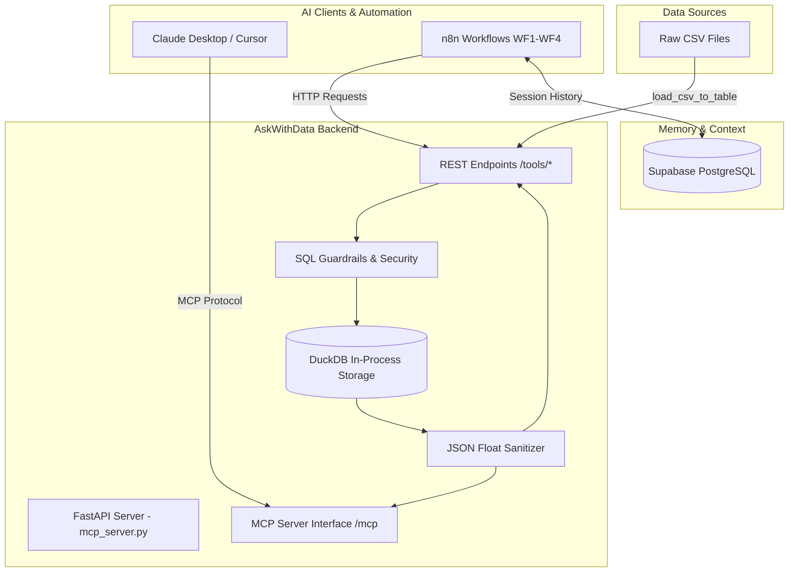

# AskWithData 📊🤖

**Autonomous AI Data Analytics Engine & Dual-Protocol MCP Backend Server**

AskWithData is a high-performance data analytics platform powered by **DuckDB**, **FastAPI**, **Model Context Protocol (MCP)**, **n8n**, and **Supabase (PostgreSQL)**. It bridges the gap between raw unstructured CSV data and conversational AI analytics by offering automated ingestion, LLM-driven data cleaning, automated statistical profiling, and interactive natural-language querying.

---

## 🌟 Key Features

* ⚡ **Dual-Protocol Architecture**: Serves both **MCP (Model Context Protocol)** endpoints for AI clients (Claude Desktop, Cursor, etc.) at `/mcp` and **REST API endpoints** for n8n workflow HTTP nodes at `/tools/*`.
* 🚀 **Vectorized DuckDB Analytics**: Uses DuckDB's in-process columnar engine (`read_csv_auto`) for sub-50ms OLAP query execution on large CSV datasets.
* 🤖 **Autonomous n8n Workflows**:
  * **WF1 – CSV Ingest**: Automatic loading of raw CSV files into DuckDB schemas.
  * **WF2 – AI Cleaning**: LLM-guided anomaly detection and query-based automated data cleaning.
  * **WF3 – Initial Insights**: Instant Exploratory Data Analysis (EDA) generating null counts, numerical statistics (min/max/avg/stddev), date ranges, and top frequency distributions.
  * **WF4 – Interactive Chat**: Multi-turn conversational SQL assistant with persistent chat context.
* 🔒 **Security & SQL Guardrails**: Strict separation between read-only analysis (`SELECT` queries) and state-modifying transformations (`UPDATE`, `DELETE`, `ALTER TABLE`), blocking destructive SQL keywords (`DROP`, `TRUNCATE`, `CREATE`, `COPY`).
* 🛡️ **Robust JSON Serialization Engine**: Built-in 2-pass float sanitizer (`safe_float` and `safe_df_to_records`) preventing server crashes caused by non-compliant float values (`NaN`, `Infinity`, `-Infinity`).
* 💾 **PostgreSQL Session Memory**: Session history and chat state management stored in **Supabase** with composite B-Tree indexing (`session_id`, `created_at DESC`) for fast sub-25ms context retrieval.
* ☁️ **Cloud-Ready & Keep-Alive Ping**: Includes a `/ping` endpoint and automated keep-alive polling to prevent cloud host (e.g., Render free tier) container spin-downs.

---

## 📐 Architecture & Workflow Pipeline



---

## 📁 Repository Structure

```text
ask_with_data/
├── mcp_server.py             # FastAPI + DuckDB server with MCP & REST endpoints
├── requirement.txt           # Python dependencies
├── .env.example              # Environment variables template
├── supabase_commands.txt     # PostgreSQL table schema & composite indexing script
├── WF1 - CSV Ingest.json     # n8n Workflow: CSV ingestion into DuckDB
├── WF2 - AI Cleaning.json    # n8n Workflow: AI-driven data cleaning
├── WF3 - Initial Insights.json # n8n Workflow: Automated EDA & data profiling
├── WF4 - Interactive Chat.json # n8n Workflow: Conversational data query assistant
├── analytics.duckdb          # DuckDB database file
└── demo.csv                  # Sample dataset for testing
```

---

## 🚀 Quick Start Guide

### 1. Prerequisites

- **Python**: `3.10` or higher
- **PostgreSQL Database**: Supabase account (or local PostgreSQL instance)
- **n8n**: Cloud or self-hosted instance (optional, for workflow automation)

---

### 2. Environment Setup

Clone the repository and set up a virtual environment:

```bash
git clone https://github.com/your-username/ask_with_data.git
cd ask_with_data

python3 -m venv venv
source venv/bin/activate  # On Windows: venv\Scripts\activate

pip install -r requirement.txt
```

Create a `.env` file from `.env.example`:

```bash
cp .env.example .env
```

Configure your `.env` variables:

```env
DUCKDB_PATH=/tmp/analytics.duckdb
HOST=0.0.0.0
PORT=8000
MCP_MOUNT_PATH=/mcp
```

---

### 3. Database Initialization (Supabase / PostgreSQL)

Open the SQL Editor in your Supabase dashboard (or PostgreSQL client) and execute the commands from `supabase_commands.txt`:

```sql
CREATE TABLE IF NOT EXISTS sessions (
  session_id TEXT PRIMARY KEY,
  schema_snapshot JSONB,
  created_at TIMESTAMPTZ DEFAULT now()
);

CREATE TABLE IF NOT EXISTS messages (
  id SERIAL PRIMARY KEY,
  session_id TEXT REFERENCES sessions(session_id) ON DELETE CASCADE,
  role TEXT NOT NULL CHECK (role IN ('user', 'assistant')),
  content TEXT NOT NULL,
  created_at TIMESTAMPTZ DEFAULT now()
);

-- B-Tree composite index for low-latency session history fetch
CREATE INDEX IF NOT EXISTS idx_messages_session_time
  ON messages (session_id, created_at DESC);

-- Helper function to ensure session exists
CREATE OR REPLACE FUNCTION ensure_session(p_session_id TEXT)
RETURNS VOID AS $$
BEGIN
  INSERT INTO sessions (session_id)
  VALUES (p_session_id)
  ON CONFLICT (session_id) DO NOTHING;
END;
$$ LANGUAGE plpgsql;
```

---

### 4. Running the Server

#### Development Mode:
```bash
python mcp_server.py
```

#### Production Mode (Uvicorn):
```bash
uvicorn mcp_server:app --host 0.0.0.0 --port 8000
```

Once running, the server exposes:
* **REST API Tools**: `http://localhost:8000/tools/*`
* **MCP Interface**: `http://localhost:8000/mcp`
* **Keep-Alive Ping**: `http://localhost:8000/ping`

---

## 🛠️ API & MCP Tool Reference

| Tool Name | Endpoint / Function | Description |
| :--- | :--- | :--- |
| `get_schema_overview` | `POST /tools/get_schema_overview` | Returns table names, column data types, row counts, and sample records. |
| `load_csv_to_table` | `POST /tools/load_csv_to_table` | Loads a local CSV file into DuckDB via vectorized `read_csv_auto()`. |
| `generate_initial_insights` | `POST /tools/generate_initial_insights` | Computes null counts, min/max/avg/stddev, date ranges, and top value frequencies. |
| `execute_cleaning_query` | `POST /tools/execute_cleaning_query` | Safely executes `UPDATE`, `DELETE`, or `ALTER TABLE` data cleaning queries. |
| `run_analysis_query` | `POST /tools/run_analysis_query` | Executes read-only `SELECT` analytical queries and returns sanitized JSON records. |
| `ping` | `GET /ping` | Lightweight status endpoint for keep-alive monitoring. |

---

## 💻 Claude Desktop / MCP Configuration

To connect Claude Desktop to this MCP server, add the following entry to your `claude_desktop_config.json`:

```json
{
  "mcpServers": {
    "ask-with-data": {
      "command": "python",
      "args": [
        "/path/to/ask_with_data/mcp_server.py"
      ]
    }
  }
}
```

---

## ⚙️ n8n Workflow Integration

Import the provided JSON workflow files into your n8n workspace:

1. **`WF1 - CSV Ingest.json`**: Triggers CSV upload into the backend DuckDB database.
2. **`WF2 - AI Cleaning.json`**: Reads schema profiles, uses an LLM node to write cleaning SQL, and applies updates safely.
3. **`WF3 - Initial Insights.json`**: Pulls statistical summaries and formats executive EDA reports.
4. **`WF4 - Interactive Chat.json`**: Handles user messages, loads context from Supabase, runs DuckDB analysis queries, and returns AI responses.

---

## 🛡️ Security & Guardrails

* **Read vs. Write Isolation**: Read-only queries (`run_analysis_query`) are restricted strictly to `SELECT` statements. Any embedded data modification attempt (`INSERT`, `UPDATE`, `DELETE`, `DROP`) inside a SELECT statement is caught and blocked.
* **Cleaning SQL Enforcement**: `execute_cleaning_query` only allows queries starting with `UPDATE`, `DELETE FROM`, or `ALTER TABLE`. Destructive statements like `DROP`, `TRUNCATE`, `CREATE`, and `COPY` are strictly prohibited.
* **Input Validation**: Table names are validated against regex `^[a-zA-Z_][a-zA-Z0-9_]*$` to prevent SQL injection during dynamic table creation.

---

## 📜 License

This project is open-source and available under the [MIT License](LICENSE).
